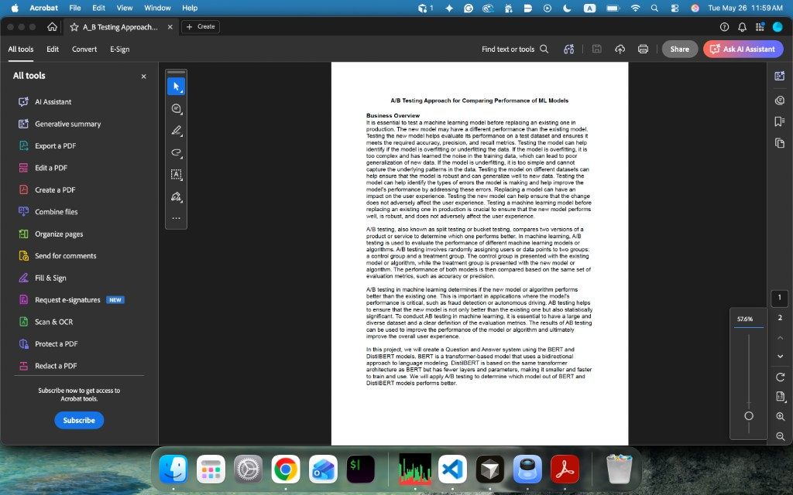

## Project summary
This project compares the practical performance of two extractive question-answering (QA) models on the SQuAD 2.0 dataset: **BERT** and **DistilBERT**. It evaluates model quality (Exact Match / F1, including answerable vs. unanswerable questions) alongside **latency**, and demonstrates an A/B-testing-style decision process for choosing a model for deployment.

## Aim
- **Measure model quality** on SQuAD 2.0 (overall + split by HasAns/NoAns).
- **Measure inference latency** and incorporate it into a deployment-oriented score.
- **Compare candidate models** (BERT vs. DistilBERT) and recommend a model based on an objective that reflects product constraints (accuracy + abstention behavior + speed).

## Repository structure
- **`Code/ab_testing.ipynb`**: end-to-end evaluation workflow, metric computation, latency measurement, and the scoring approach used to compare models.
- **`Code/run_squad.py`**: a CLI script for fine-tuning and/or evaluating Hugging Face QA models on SQuAD-format JSON (train/eval).  
  Note: this file contains upstream Apache-2.0 license headers.
- **`Code/f1score.png`**, **`Code/model_params.png`**: figures referenced by the notebook.
- **`Data/Squad/dev-v2.0.json`**: SQuAD 2.0 dev set used for evaluation.
- **`assets/architecture.png`**: high-level project overview image used in this README.

## Tools & technologies
- **Language**: Python
- **Core ML**: PyTorch
- **NLP / Models**: Hugging Face Transformers (AutoTokenizer, AutoModelForQuestionAnswering, SQuAD utilities)
- **Data / Analysis**: NumPy, Pandas
- **Progress / Logging**: tqdm, TensorBoard
- **Dataset**: SQuAD 2.0 (dev set included under `Data/Squad/`)

## Installation
### Prerequisites
- Python 3.9+ recommended
- (Optional) CUDA-capable GPU for faster evaluation/training

### Setup
Create and activate a virtual environment, then install dependencies:

```bash
python -m venv .venv
source .venv/bin/activate
pip install -r requirements.txt
```

## Running the project
### Option A — Run the notebook (recommended)
The notebook contains the full comparison workflow and produces the key metrics and latency measurements.

```bash
pip install jupyter
jupyter lab
```

Open `Code/ab_testing.ipynb` and run the cells.

### Option B — Evaluate / fine-tune using the CLI script
`Code/run_squad.py` supports training and evaluation on SQuAD-format JSON files. For evaluation-only on the included dev set:

```bash
python Code/run_squad.py \
  --model_type bert \
  --model_name_or_path twmkn9/bert-base-uncased-squad2 \
  --do_eval \
  --version_2_with_negative \
  --data_dir Data/Squad \
  --predict_file dev-v2.0.json \
  --output_dir outputs/bert_eval
```

To evaluate DistilBERT:

```bash
python Code/run_squad.py \
  --model_type distilbert \
  --model_name_or_path twmkn9/distilbert-base-uncased-squad2 \
  --do_eval \
  --version_2_with_negative \
  --data_dir Data/Squad \
  --predict_file dev-v2.0.json \
  --output_dir outputs/distilbert_eval
```

### Outputs
Depending on the path you run:
- The notebook writes model outputs under `models/` (as configured in the notebook).
- The CLI script writes predictions, n-best predictions, null-odds (when applicable), logs, and checkpoints under the `--output_dir`.

## Notes on attribution
`Code/run_squad.py` includes Apache-2.0 license headers from the original authors (Google AI Language Team / Hugging Face / NVIDIA). If you plan to redistribute or publish this repository, keep the license headers intact and ensure compliance with the Apache-2.0 terms.

